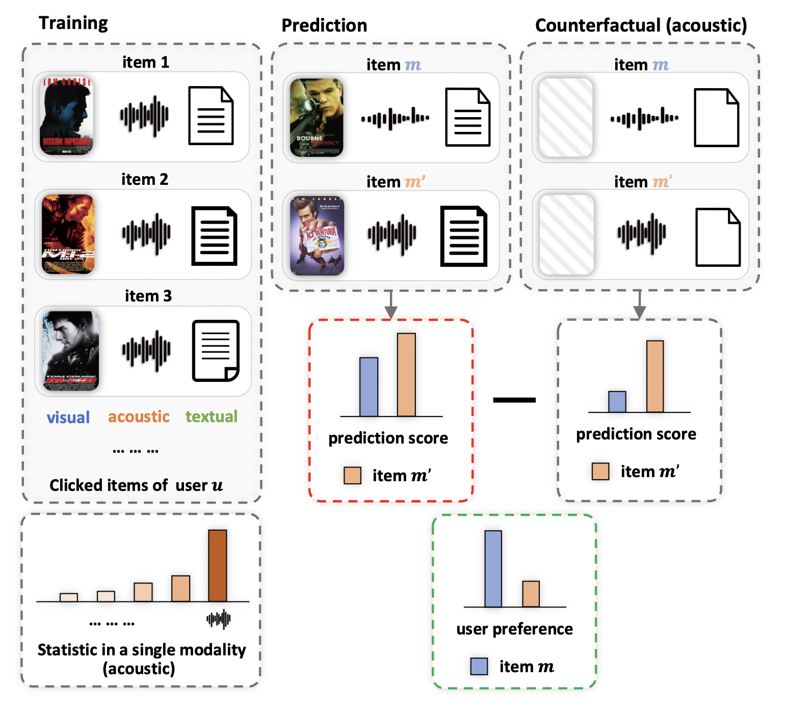

# EliMRec

__"EliMRec: Eliminating Single-modal Bias in Multimedia Recommendation"__

Xiaohao Liu, Zhulin Tao, Jiahong Shao, Lifang Yang, Xianglin Huang, [ACMMM](https://dl.acm.org/doi/abs/10.1145/3503161.3548404), June 2022

We explored single-modal bias by revealing the inner working of multi-modal fusion and achieved a generic framework EliMRec so as to eliminate single-modal bias in multimedia recommendation.

<p align="center">

</p>

## Installation

The code has been tested running under Python 3.6.5. The required packages are as follows:
* torch==1.7.0
* numpy==1.16.1
* torch_geometric==1.6.1

## Data download
We provide three processed datasets: Kwai, Tiktok, and Movielnes.  
- You can find the full version of recommendation datasets via [Kwai](https://www.kuaishou.com/activity/uimc), [Tiktok](http://ai-lab-challenge.bytedance.com/tce/vc/), and [Movielens](https://grouplens.org/datasets/movielens/).
Since the copyright of datasets, we cannot release them directly. 

## Run EliMRec
The hyper-parameters used to train the models are set as default in the `conf/EliMRec.properties`. Feel free to change them if needed.

```sh
python3 main.py --recommender="EliMRec" --data.input.dataset=tiktok
```

## Citation

```
@inproceedings{EliMRec,
author = {Liu, Xiaohao and 
          Tao, Zhulin and 
          Shao, Jiahong and 
          Yang, Lifang and 
          Huang, Xianglin},
title = {EliMRec: Eliminating Single-Modal Bias in Multimedia Recommendation},
year = {2022},
publisher = {Association for Computing Machinery},
doi = {10.1145/3503161.3548404},
booktitle = {Proceedings of the 30th ACM International Conference on Multimedia},
series = {MM '22}
}
```
